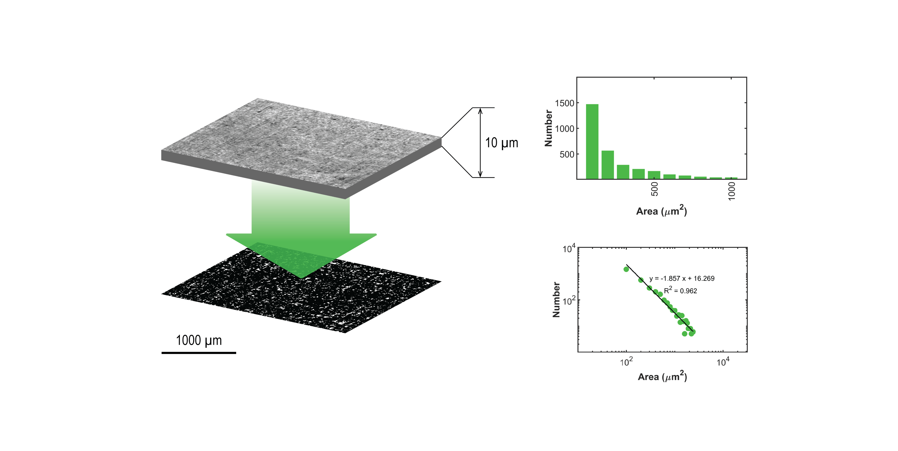

# FVanalysis
Choriocapillaris flow voids analysis bar and log-log plots featuring the number of flow voids against area size.  Log-log plot best fit line parameters (intercept, slope) and the fraction of flow voids exceeding 10,000 square micron (FV10000) over the total eye surface are provided.

Choriocapillaris flow voids analysis is described in:

R. F. Spaide, "Choriocapillaris flow features follow a power law distribution: implications for characterization and mechanisms of disease progression," American journal of ophthalmology, vol. 170, pp. 58-67, 2016.

usage:

```matlab
[m, b, fv10K] = call_FVanalysis()
```

Cite As

C. B. Nzakimuena, "Automated analysis of retinal and choroidal OCT and OCTA images in AMD," Polytechnique Montréal, 2020


