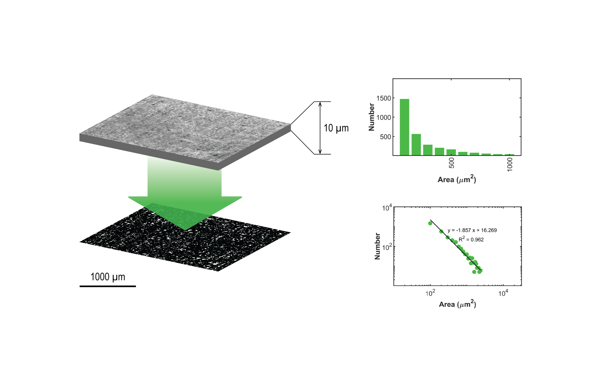

# FVanalysis
The 'FVanalysis' algorithm generates choriocapillaris flow voids analysis bar and log-log plots featuring the number of flow voids against area size. Log-log plot best fit line parameters (intercept, slope) and the fraction of flow voids exceeding 10,000 square micron (FV10000) over the total eye surface are provided.<br/> 
The 'ccflowVoids' algorithm gives parameter values corresponding to ETDRS subfieds in table format.  It is designed to be executed following the execution of 'segPLEX' (https://github.com/cnzakimuena/segPLEX).  Previously processed folders from 'segPLEX' (e.g. for ‘SamplePatient_01’, ‘SamplePatient_02’, etc.) each containing a 'Results' subfolder should be inserted into a 'processed' folder.  The 'processed' folder should be located inside the current directory (sample input dataset: https://www.kaggle.com/cnzakimuena/retinal-oct-and-octa-data-3).<br/> 

Choriocapillaris flow voids analysis is described in:

R. F. Spaide, "Choriocapillaris flow features follow a power law distribution: implications for characterization and mechanisms of disease progression," American journal of ophthalmology, vol. 170, pp. 58-67, 2016.

usage:

```matlab
[m, b, fv10K] = call_FVanalysis()
call_ccflowVoids()
```

Cite As

Bélanger Nzakimuena, C. (2020). Automated Analysis of Retinal and Choroidal OCT and OCTA Images in AMD (Masters thesis, Polytechnique Montréal). Retrieved from https://publications.polymtl.ca/5234/


